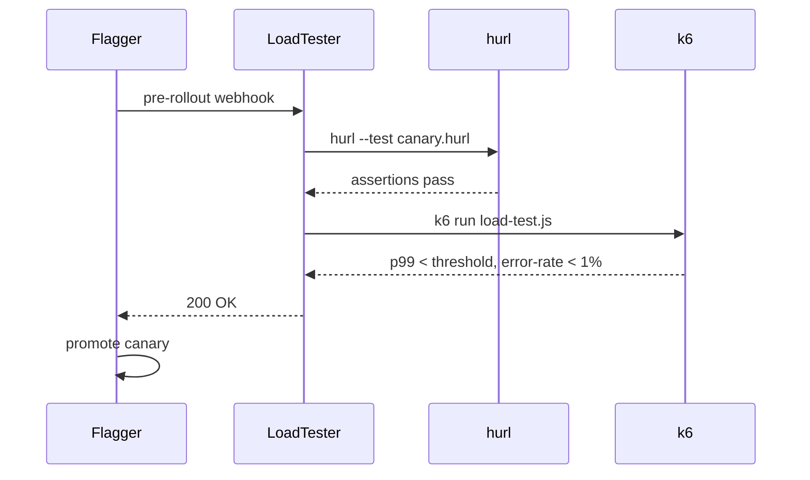

# k8s-flagger-tester

> Flagger load-tester extended with hurl and k6 for HTTP assertion and load-test canary gates.

[](https://github.com/vikas027/k8s-flagger-tester/releases)
[](https://hub.docker.com/r/vikas027/k8s-flagger-tester)
[](https://hub.docker.com/r/vikas027/k8s-flagger-tester)
[](https://github.com/vikas027/k8s-flagger-tester/actions/workflows/ci.yaml)
[](https://github.com/vikas027/k8s-flagger-tester/actions/workflows/release.yaml)
[](https://securityscorecards.dev/viewer/?uri=github.com/vikas027/k8s-flagger-tester)

---

<svg width="600" height="120" xmlns="http://www.w3.org/2000/svg">
  <defs>
    <style>
      .box { fill: #1e40af; rx: 8; }
      .label { fill: #fff; font-family: monospace; font-size: 13px; text-anchor: middle; dominant-baseline: middle; }
      .arrow { fill: none; stroke: #60a5fa; stroke-width: 2.5; marker-end: url(#arrowhead); stroke-dasharray: 8 4; }
      @keyframes dash { to { stroke-dashoffset: -24; } }
      .arrow { animation: dash 1s linear infinite; }
    </style>
    <marker id="arrowhead" markerWidth="8" markerHeight="6" refX="6" refY="3" orient="auto">
      <polygon points="0 0, 8 3, 0 6" fill="#60a5fa" />
    </marker>
  </defs>
  <rect x="10" y="35" width="140" height="50" rx="8" class="box" />
  <text x="80" y="60" class="label">New Version</text>
  <line x1="150" y1="60" x2="210" y2="60" class="arrow" />
  <rect x="210" y="35" width="180" height="50" rx="8" class="box" />
  <text x="300" y="60" class="label">Canary Tests</text>
  <text x="300" y="75" class="label" style="font-size:10px;">(hurl + k6)</text>
  <line x1="390" y1="60" x2="450" y2="60" class="arrow" />
  <rect x="450" y="35" width="140" height="50" rx="8" class="box" />
  <text x="520" y="55" class="label">Promote /</text>
  <text x="520" y="72" class="label">Rollback</text>
</svg>

---

## Overview

`k8s-flagger-tester` extends the official [Flagger load-tester](https://github.com/fluxcd/flagger/tree/main/pkg/loadtester) image with two additional tools pre-installed:

- **[hurl](https://hurl.dev/)** — declarative HTTP testing with assertions, used as Flagger webhook gates to verify a canary is functionally correct before traffic is shifted
- **[k6](https://k6.io/)** — scriptable load testing, used as a Flagger webhook gate to verify latency and error-rate thresholds under synthetic load

All bundled tools are installed at their latest stable versions with explicit version ARGs, making upgrades a single-line diff.

## Why Debian?

Alpine Linux uses musl libc. The hurl 8.x upstream releases a single Linux binary linked against glibc — there is no musl build. Running a glibc binary on Alpine requires a compat layer (`libc6-compat`) that is fragile and not officially supported by the hurl project. This image uses Debian bookworm-slim (glibc) as the runtime base to avoid those issues entirely. All static Go binaries (k6, kubectl, helm, ghz, grpc_health_probe) work unchanged on both musl and glibc, so nothing is lost in the switch.

## What's Included

| Tool | Version | Purpose |
|------|---------|---------|
| flagger-loadtester | 0.37.0 | Canary webhook handler — receives Flagger pre/post-rollout hooks |
| hurl | 8.0.1 | HTTP assertion testing — validate endpoints before traffic shifts |
| k6 | v2.0.0 | Load testing — verify latency and error-rate thresholds |
| helm | v4.2.2 | Chart operations in webhook scripts |
| kubectl | v1.36.2 | Cluster operations in webhook scripts |
| bats | v1.13.0 | Bash-based test suites in webhook scripts |
| ghz | v0.121.0 | gRPC benchmarking |
| grpc_health_probe | v0.4.52 | gRPC health checks |

## Usage

Override the image in your Flagger load-tester HelmRelease values:

```yaml
loadtester:
  image:
    repository: vikas027/k8s-flagger-tester
    tag: latest
```

Or directly in a Kubernetes Deployment:

```yaml
apiVersion: apps/v1
kind: Deployment
metadata:
  name: flagger-loadtester
  namespace: test
spec:
  selector:
    matchLabels:
      app: loadtester
  template:
    metadata:
      labels:
        app: loadtester
    spec:
      containers:
        - name: loadtester
          image: vikas027/k8s-flagger-tester:latest
          ports:
            - containerPort: 8080
```

## Canary Gate Flow



## Development

Build locally for amd64:

```bash
docker build --platform linux/amd64 .
```

Override tool versions at build time:

```bash
docker build \
  --platform linux/amd64 \
  --build-arg HURL_VERSION=8.0.1 \
  --build-arg K6_VERSION=v1.7.1 \
  .
```

## Dependency Updates

Two bots run side-by-side to keep every pinned version current:

| Bot | What it tracks | Config | Schedule |
|-----|---------------|--------|----------|
| [Dependabot](https://docs.github.com/en/code-security/dependabot) | `FROM` base images in `Dockerfile` · GitHub Actions SHAs in `.github/workflows/` | `.github/dependabot.yml` | Weekly |
| [Renovate](https://docs.renovatebot.com/) | `ARG` tool versions in `Dockerfile` — `HURL_VERSION`, `K6_VERSION`, `HELM_VERSION`, `KUBECTL_VERSION`, `GHZ_VERSION`, `GRPC_HEALTH_PROBE_VERSION` | `renovate.json` | On push + scheduled |

**Why two bots?** Dependabot understands Docker `FROM` lines and GitHub Actions natively. It cannot update `ARG` version strings. Renovate fills that gap via regex-based custom managers, opening a PR whenever any of the tool versions in the Dockerfile has a new upstream release.

Renovate requires the [Renovate GitHub App](https://github.com/apps/renovate) to be installed on the repository — it is already configured for this repo.

## Contributing

Commits must follow [Conventional Commits](https://www.conventionalcommits.org/). Install the pre-commit hook:

```bash
pip install pre-commit
pre-commit install
pre-commit install --hook-type commit-msg
```
