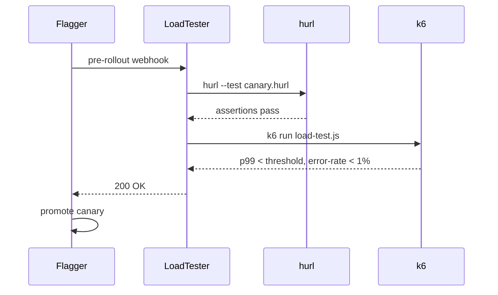

# k8s-flagger-tester

> Flagger load-tester extended with **hurl** and **k6** for HTTP assertion and load-test canary gates.

## Overview

`k8s-flagger-tester` extends the official [Flagger load-tester](https://github.com/fluxcd/flagger/tree/main/pkg/loadtester) with two additional tools pre-installed:

- **[hurl](https://hurl.dev/)** — declarative HTTP testing with assertions, used as Flagger webhook gates to verify a canary is functionally correct before traffic is shifted
- **[k6](https://k6.io/)** — scriptable load testing, used as a Flagger webhook gate to verify latency and error-rate thresholds under synthetic load

All bundled tools are installed at their latest stable versions with explicit version `ARG`s, making upgrades a one-line diff.

## Why Debian?

Alpine Linux uses musl libc. The hurl 8.x upstream releases a single Linux binary linked against glibc — there is no musl build. Running a glibc binary on Alpine requires a compat layer that is fragile and not officially supported. This image uses **Debian bookworm-slim** (glibc) as the runtime base. All static Go binaries (k6, kubectl, helm, ghz, grpc_health_probe) work unchanged on both.

## What's Included

| Tool | Version | Purpose |
|------|---------|---------|
| flagger-loadtester | 0.37.0 | Canary webhook handler |
| hurl | 8.0.1 | HTTP assertion testing |
| k6 | v2.0.0 | Load testing |
| helm | v4.2.2 | Chart operations |
| kubectl | v1.36.2 | Cluster operations |
| bats | v1.13.0 | Bash-based test suites |
| ghz | v0.121.0 | gRPC benchmarking |
| grpc_health_probe | v0.4.52 | gRPC health checks |

## Canary Gate Flow

